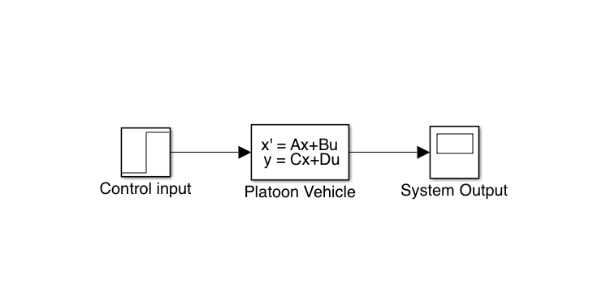
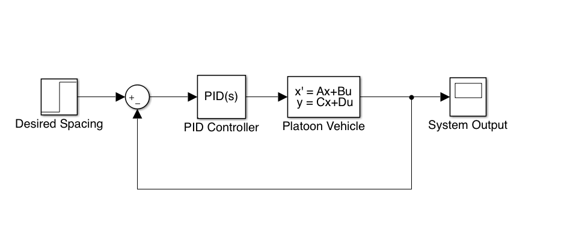

# Project 2: Vehicle Platooning {-}

The main objective of this project is to design a controller for a platoon of vehicles in order to optimize the traffic flow and reduce the fuel consumption. A platoon of vehicles can be seen as: 

(ref:cav) Example of a vehicle platoon. 

```{r cav, fig.cap='(ref:cav)', fig.align = 'center', fig.width = 4, echo= FALSE}
knitr::include_graphics("images/p2-cavs.png")
```

The objective illustrated in Figure \@ref(fig:cav) is to control the *headway space* between two single vehicles in a formation of multiple vehicles. This project is inspired in works presented on [@Duret2019:ISTTT], [@Meng2014b:TR-C] but more information about platoons can be found at [@Ali2015:ITSM].

## Objectives {-}

The main objective of this project is to:

1. Study and understand the fundamental problem of string stability. 
2. Obtain and create a dynamic model for vehicle platoons and asociate its parameters with traffic theory. 
3. Create and design a control strategy for the headway space and analyze its behavior. 
4. Compare and analyze the behavior of parameter setups for variations of the proposed control strategy

## Description {-}

### Task 1: Platoon modeling {-}

Consider the dynamical model presented in [@Duret2019:ISTTT], [@Turri2017] where the problem of truck platooning is detailed.  

#### Context {-}

In general the platoon problem is a *dynamic control problem* where the objective is to regulate or mantain the value of a specific variable within the system at a desired level. In order to produce this regulation a *controller* is requrired and in most of the cases cases there is always a way to express the dynamical model in the following form: 

\begin{align}
\dot{x}(t) = f(x(t), u(t)) (\#eq:platoon)
\end{align}

where $x(t), u(t)$ correspond to the state vector, and the control vector of the system. In general a system describing this behavior is called *dynamic* system. In case of platoon the state vector represents all the variables that contain *minimum* information to represent the system like, vehicle position, speed, or headway space. The control vector correspond to the variables that are inputs to the systems, e.g. acceleration when modifying the state of a vehicle. 

#### Questions {-}

* What are the main goals of platoon strategies, and how they can improve the traffic in future? 
* Create a model for a platoon of 4 vehicles that considers a simple dynamic model of 2nd order and a 3rd order one. **Note: Consider for this case a model in which no drag is present within the model.**. This model can be written as in  \@ref(eq:platoon) where the stability can be analyzed. 
* Which could be the traffic parameters in this kind of models? 
 

#### Expected outcomes {-}

* Present a brief summary on the motivations to create vehicle platoons and the main existing models that can be developed for this purpose.
* Based on the work of [@Duret2019:ISTTT], [@Meng2014b:TR-C] determine writedown the state equations for a platoon model of 4 vehicles of *2nd order* and *3rd order*.  
* Determine the stability properties of the model. Stability properties are associated to the location of zeros and poles of the transfer function of the model or eigen values of the matrix [See more](https://en.wikipedia.org/wiki/Stability_theory)

***

### Task 2: Open loop simulation {-}

#### Context {-}

One of the first studies in terms of analyzing the properties of a dynamical system is the dynamical response of the system. This response can be characterized by the step response of the system to a specific control input. 

(ref:opencav) Open loop system. 

```{r opencav, fig.cap='(ref:opencav)', fig.align = 'center', fig.width = 4, echo= FALSE}

```

For the case of a platoon vehicle the input in *open* loop are the accelerations of all vehicles. It seems logical that if a vehicle modifies its speed from a specific value the space between two vehicles. We are going to verify this behavior at simulation level. 

#### Questions {-}

* Which is the response of spacing of all vehicles when an impulse of deceleration of amplitude $u = 0.1m/s^2$ is performed over the second vehicle? *
* Are there any differences between the spacings when applying the decceleration over a *2nd order* model or a *3rd order model*? 
* Consider the *time engine* constant in the *3rd order* model. What is the effect of this vale in the dynamic acceleration/ decceleration of the system? 

#### Expected outcomes {-}

* Create a simulation of the *2nd /3rd order* platoon vehicle models in which the inputs are the accelerations of all vehicles and the outcomes are the headway spaces, and speeds of each vehicle. 
* Retrieve the dynamic response of the headway space for the 2nd order/ 3rd order for an impulse of  $u = 0.1m/s^2$
* Obtain the trajectories in space and time for the platoon of 4 vehicles.

### Task 3: Vehicle platoon control {-}

***

#### Context {-}

In order to control the system a feedback loop should be introduced in terms of accelerations of vehicles as shown in the Figure \@ref(fig:closedcav) 

(ref:closedcav) Closed loop system. 

```{r closedcav, fig.cap='(ref:closedcav)', fig.align = 'center', fig.width = 4, echo= FALSE}

```

Whithin the Figure \@ref(fig:closedcav)  the main objective is to create a closed loop that provides information in order to take the decision. These strategies have been already studied in literature. [@Meng2014b:TR-C], [@Ali2015:ITSM].

#### Questions {-}

* Based on the control strategy proposed in [@Meng2014b:TR-C]. Which is one of the possibles control structures that can be used for these systems?
* Define and justify some specific values for the proportional integral control parameters.
* Set the desire spacing of the system to a specific value of $10m$ for all vehicles, then test a change in the headway space of $5m$ for one of the vehicles. What do you see as a different behavior? 

#### Expected outcomes {-}

* Provide the dynamical response of the open-loop (headway space/speed) system, (all headway spacings/ speed profiles) to a change in decceleration of $0.1m/s^2$, applied over 1s.  
* Provide the dynamical response of the closed-loop (headway space/speed) system,  (all headway spacings/ speed profiles) to a change in spacing of $5m$. 
* Compare the situations and conclude about the implementation of control systems on vehicle automatization. What are the benefits of implementing this type of algorithms? 

### Task 4: Performance evaluation {-}

#### Context {-}

In order to provide a final evaluation it is important to measure the dynamical performance of the control strategy. This dynamical response can be measured as in \@ref(fig:dynamic2).

(ref:dynamic2) Typical dynamical response for a 2nd order model

```{r dynamic2, fig.cap='(ref:dynamic2)', fig.align = 'center', fig.width = 4, echo= FALSE}
knitr::include_graphics("images/p2-04-evaluation.png")
```

#### Questions {-}

* Measure the dynamical response, setting time, rise time for the controller operated on the 2nd order model and 3rd order model. What can you conclude about the dynamical step response?
* Provide a variation of parameters in the contoller provided. How the parameters may affect the stability of the model? 

#### Expected outcomes {-}

* Provide an analysis from values obtained of simulations of the same control for multiple models (2nd/3rd order).
* Construct and determine the effects of modifying control parameters when they are applied to multiple models. 

## Sources {-}

For more details on how to deploy traffic simulations and traffic models please check:

- [Simulation results - Github](https://github.com/research-licit/Hierarchical-Platooning/blob/dev/Operational/platoon-closed-3rd.py)

- Check [@Duret2019] available [Link](http://bit.ly/Hierarchical_ISTTT)


