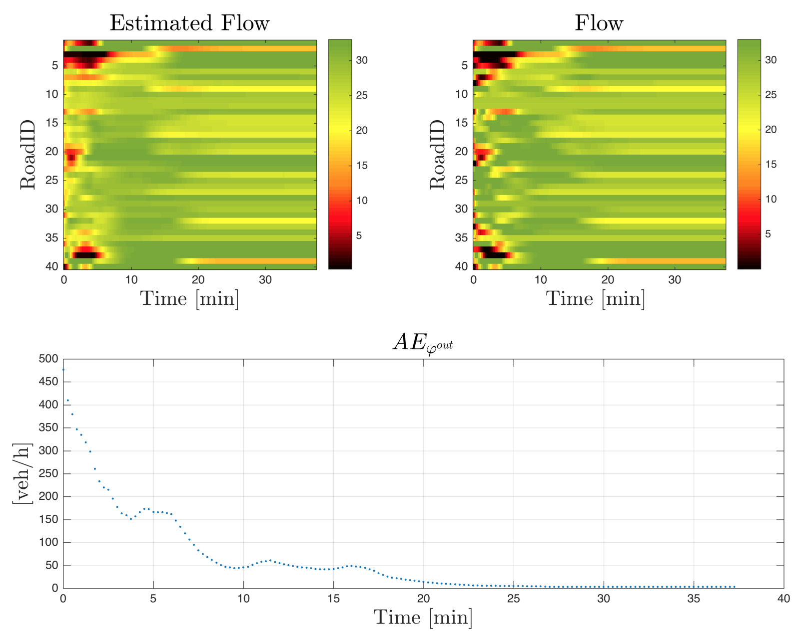

# Project 3: Density Reconstruction {-}

The state of congestion of a city is one of the critical. This project aims to study the reconstruction of traffic variables from different type of sources. For more information the detail of this work can be found at [@Lovisari2016], [@Ladino2018].



In this approach in particular, the reconstruction of density will be based on multiple hypothesys. 

* There exist multiple sources of traffic information such as *Floating Car Data (FCD)* or *Magnetic Loop Data (MLD)*, the nature of these two measurements is different. While FCD can be collected easily and almost every where in the traffic network, it is not really representative of the congestion state due to the penetration rate. Its counter part MLD is accurate when determining the amount of vehicles circulating at specific spots, but extending this mechanism of measurement to the whole network is expensive. 
* The use of models like the LWR model may be useful for providing extra information to retrieve the congestion state of the network. 

***

## Objectives {-}

The main objective of this project is to: 

1. Study the LWR model and in particular its network counter part. 
2. Obtain and simulate a macroscopic traffic model for a urban network. 
3. Create and design an estimator in order to retrieve the state of the network based on heterogenous measurements. 
4. Compare the behavior and performance of the estimator under multiple situations. 

## Description {-}

***

### Task 1: Modeling {-}

Consider reading [@Daganzo1994:TR-B] to understand the first basic principles and [@Ladino2018] for more details about the network problem. 

#### Context {-}

In order to reconstruct the traffic models for this project it is important to understand the principle of demand supply prescribed in the *Cell Transmission Model (CTM)* [@Daganzo1994:TR-B] and its extensions to the network case [@Ladino2018].

(ref:fdiag) Demand/Supply Principle. 

```{r fdiag, fig.cap='(ref:fdiag)', fig.align = 'center', fig.width = 3.5, fig.asp= 0.7, echo= FALSE}
library(ggplot2)
N <- 0.1 # sampling 
x <- seq(from = 0,  to = 1,  by = N)

y1 <- pmin(x, 0.5)
y2 <- pmin(0.5, -x+1)
Demand <- data.frame(c(list(x),list(y1)))
Supply <- data.frame(c(list(x),list(y2)))
names(Demand) <- c("Density", "Flow")
names(Supply) <- c("Density", "Flow")
ggplot(data=Demand,aes(x=Density,y=Flow))+geom_line(color='red', show.legend = TRUE)+ 
  geom_line(data = Supply, color='blue',show.legend = TRUE) 
```

Within the Figure [@Ladino2018] the *red* curve represnets the *demand* of a link and the *blue* curve represents the *supply* of the link. The main objective is to model the fixed capacity of the flow. In this approach the blue line is determined by information *downstream* the network while the red line is determined by information *upstream*.   


(ref:citynet) City network model 

```{r citynet, fig.cap='(ref:citynet)', fig.align = 'center', fig.width = 4, echo= FALSE}
knitr::include_graphics("images/p1-01-network.png")
```


#### Questions {-}

* Explore the relationship of the fundamental diagram  \@ref(fig:fdiag). Remember that this is a function defined for two different intervals. Knowing that $\phi = v\rho$ is a fundamnetal relationship on traffic, determine the relationship between $v$ and $\rho$. Is it possible to have a univoque relationsihp for all cases? 
* Check the conditions that are required for recovering the density in [@Lovisari2016], why are these conditions required? 
* Based on a literature review, determine the traffic model for teh network exposed in \@ref(fig:citynet).

#### Expected outcomes {-}

* Present a brief summary of the existing current models for traffic networks. At same time highlight the key features of these models and the remaining difficulties. Consider including references for the presented models. 

* Based on [@Lovisari2016], [@Ladino2018] obtain a model for the signalized network of Figure \@ref(fig:city) and the parameters required model this corridor. 

* Define the set of parameters for the traffic network, notably those related to the fundamental diagram and splitting ratio . Consider a fixed setup of this parameters for the moment and overall explain the reason of the choice.  


***

### Task 2: Simulation {-}

Dynamic simulation  of open loop traffic networks. For this task be sure to review already implemented simulations available at [Link](https://github.com/aladinoster/density-reconstruction). Get familiar with the code here developed before you enter into details of implementation. 

#### Context {-}

In order to implement the model of the network that will help the reconstruction algorithm, please consider

\begin{align}
\rho(k+1) = \rho(k) + (R^T - I)\varphi^{out}(t) + \varphi^{ext}(t) (\#eq:lwr)
\end{align}

where in particular $\varphi^{out}(k)$ is found: 

\begin{align}
\underset{\varphi^{out}}{\max} \sum_i \varphi^{out}_i\quad \text{s.t}\quad \varphi^{out} \in \mathcal{P}
\end{align}

#### Questions {-}

* Design and create a simulation of the traffic network for the case in which the value of splitting ratio is $0.6$ if the flow follows the straight direction and the rest of the percentage divides equally for turning directions. Select in this case fixed values of demand. What are the values of density and 
* Verify the equilibrium condition on the network, see more details in [@Ladino2018]. Does it holds for the particular value? For this purpose initialize the traffic evolution from different initial conditions and constant values of demand, how long does the network takes to reach equilibrium? 
* Add a random noise $\sim \mathcal{N}(0,0.1)$ to each one of the splitting ratios within the network. How 

#### Expected outcomes {-}

* Present the dynamic profiles for density on each one of the roads under different setups of traffic lights. The dynamic profiles should specify density per road in time  

* Provide comparisons between different traffic models with and without noise in the parameters and an analysis on how this error evolves according to different values of demand. 

* Initialize the simulation from different initial conditions and constant values of demand. And obtain the equilibrium points of the network, determine also the time to reach this equilibrium values.  

***

### Task 3: Estimation algorithm {-}

#### Context {-}

Two different reconstruction algorithms have been proposed in [@Lovisari2016] and [@Ladino2018], both of them follow the principle of accounting for speed and flow measurements in order to retrieve the state of the network. Please exam these works before implementing the estimation algorithm. 

The estimation technique can be reduced to the solution of the following optimal problem 

\begin{align}
\underset{\rho,\varphi}{\min} \|C\varphi - \bar{\varphi}\|^2 + \|S(\rho - \Psi^{-1}(v))\|^2 +  \|(R^T-I)\varphi +\varphi^{ext}\|^2\quad \text{s.t}\quad \varphi \in \mathcal{P}_\varphi, \rho \in \mathcal{P}_\rho
\end{align}

#### Questions {-}

* What are the differences between the algorithms proposed in [@Lovisari2016] and [@Ladino2018]?
* Implement the estimation algorithm from [@Ladino2018]. Consider as a guide the code [here](https://github.com/aladinoster/density-reconstruction/blob/master/Estimation.m) as a guide. 
* Solve the estimation problem for the following set of measurements. [here](https://github.com/aladinoster/density-reconstruction/blob/master/NoEq_4x4.mat).

#### Expected outcomes {-}

* Provide an algorithm that performs the estimation 
* Provide the dynamical response of the algorithm

* Provide the dynamical response of the open-loop (headway space/speed) system, (all headway spacings/ speed profiles) to a change in decceleration of $0.1m/s^2$, applied over 1s.  
* Provide the dynamical response of the closed-loop (headway space/speed) system,  (all headway spacings/ speed profiles) to a change in spacing of $5m$. 
* Compare the situations and conclude about the implementation of control systems on vehicle automatization. What are the benefits of implementing this type of algorithms? 

*** 


### Task 4: Estimation performance {-}

#### Context {-}

In order to compare the results it is required to compute the error between the estimated values and the real values with respect to the real values. In this case retrieve the real values from the following link [here](https://github.com/aladinoster/density-reconstruction/blob/master/Osc_4x4.mat)

#### Questions {-}

* Measure the error in the state (density) and the (outflow) between the real values and the simulated values. 
* How the parameters may affect the performance of the estimation algorithm? 

#### Expected outcomes {-}

* Provide the computation of the error for between the estimated and the real values for the nominal parameters and the parameters perturbed with noise. 
* Provide conclusions on future work for this estimation technique. 

## Sources {-}

For more details on the project please check: 

- [Simulation results - Github](https://github.com/aladinoster/density-reconstruction)

- Check [@Ladino2018] available at [Link](https://hal.archives-ouvertes.fr/hal-01731356) and [@Lovisari2016] available at [Link](https://hal.archives-ouvertes.fr/hal-01375928)

